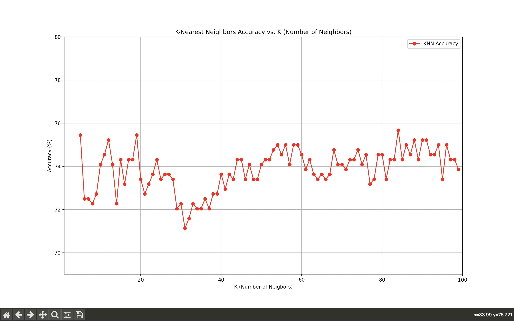
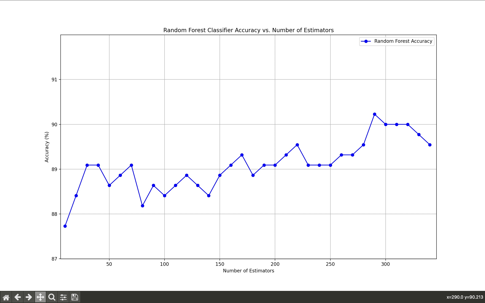

# Smart Agriculture: Predicting Water Levels for Smart Irrigation

## Introduction

This research paper focuses on implementing a Smart Irrigation System to control excessive soil water using subsurface drainage. The model uses IoT sensor data from [Kaggle](https://www.kaggle.com/datasets/nelakurthisudheer/dataset-for-predicting-watering-the-plants) and runs on a Raspberry Pi. The Microcontroller sends sensor data to the model. The goal is to predict water levels and take preventive actions to mitigate water loss.

## Model Overview

The implemented model utilizes K-Nearest Neighbors (KNN) and Random Forest algorithms to predict water levels based on IoT sensor data received from Raspberry Pi.

### Model Performance

#### With Un-imputed Data (2200 Rows)

- Best K for KNN: 84
  - Accuracy: 75.68%

- Best Number of Estimators for Random Forest: 290
  - Accuracy: 90.23%

#### With Imputed Data (100000 Rows)

- Best K for KNN: 20
  - Accuracy: 90.98%

- Best Number of Estimators for Random Forest: 180
  - Accuracy: 99.61%

## Test Results (Un-imputed Data)

### K-Nearest Neighbors (KNN)

#### Graph: Accuracy vs. K

### Random Forest

#### Graph: Accuracy vs. Number of Estimators

## Conclusion

In conclusion, the results demonstrate the effectiveness of the implemented Smart Irrigation System. The imputed data significantly improves the accuracy of predictions, reaching up to 99.61% with the Random Forest algorithm.
